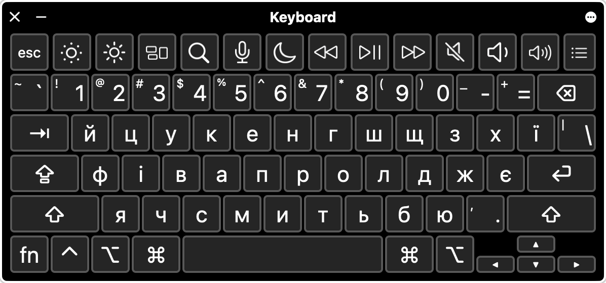
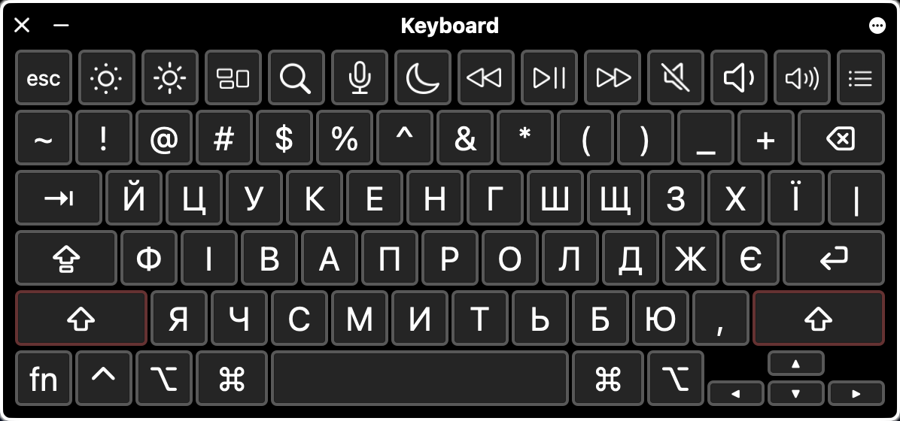
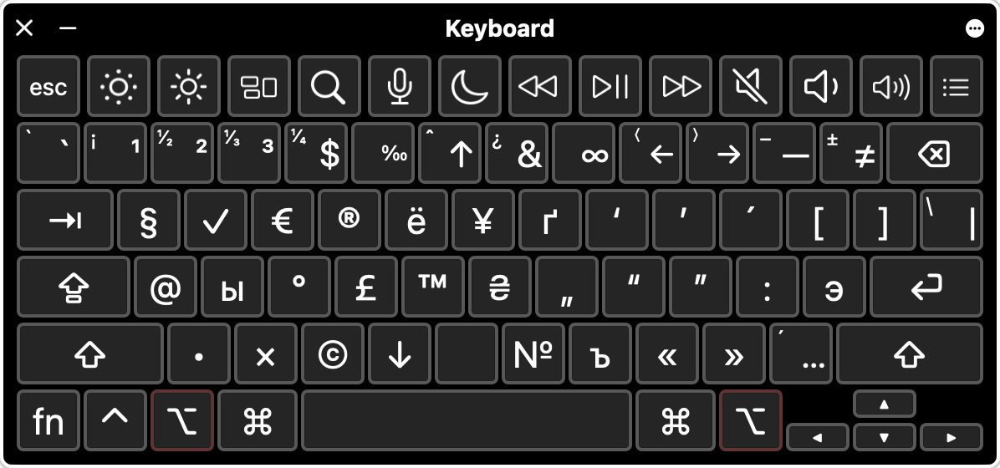
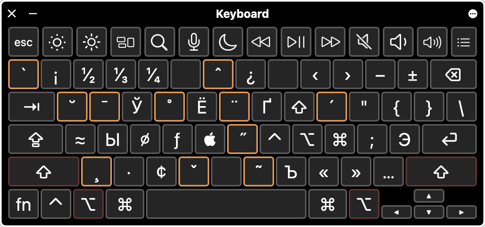
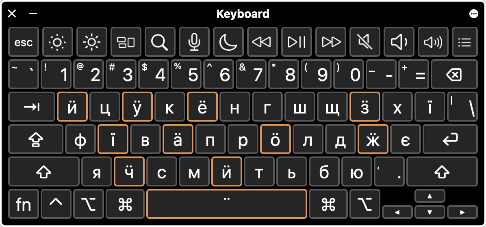
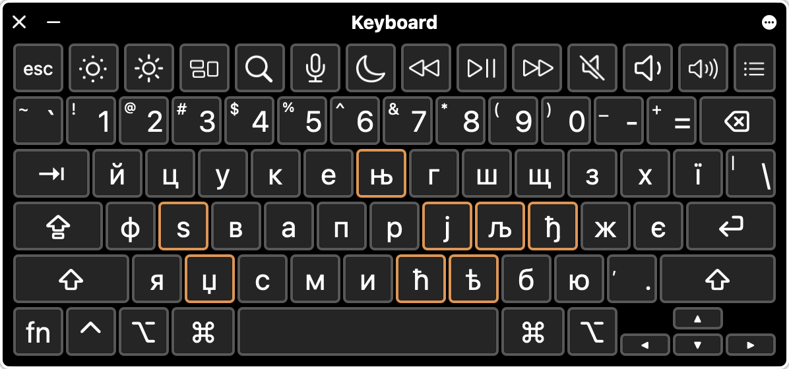

    

# Ukrainian Typography Keyboard

Ukrainian keyboard layout with typographic symbols based on Ilya Birman's typography keyboard

## Installation

### Installer

* Download a `ukrainian-typography.dmg` from the [release page](https://github.com/AntonShevchuk/ukrainian-typography-keyboard-layout/releases)
* Run the `Keyboard Installer`
* Drag and drop `ukrainian-typography.bundle` to the installer window
* Choose one of the available options:
  * Install for current user (recommended)
  * Install for all users (Sierra or earlier)
* After a logout you can add the typographic layout in `System Preferences` > `Keyboard` > `Input Sources` menu

### Manual

* Download [archive](https://github.com/AntonShevchuk/ukrainian-typography-keyboard-layout/archive/master.zip)
* Move `ukrainian-typography.bundle` to the folder with keyboard layouts for the current user:
  * Open Finder window
  * Press `Command`+`Shift`+`G`
  * Input path `~/Library/Keyboard Layouts` and press `Enter`
  * Move file here
* After a logout you can add the typographic layout in `System Preferences` > `Keyboard` > `Input Sources` menu

## Layout
Ukrainian typography layout offers several useful options:

- You can use correct typography symbols like `—` and `…`.
- It includes pairs of different brackets such as `«»`, `„“`, `“”`, and `‘’`.
- Special symbols like `©`, `®`, and `™` are also available.
- The degree symbol `°` allows you to write temperatures like `+24°C`.
- Math symbols such as `1¹+2²+3³≠30`, `¹⁄₂+¹⁄₃+¹⁄₄≈1`, and `2×2=4` are easily accessible.
- You can type symbols of currencies like `₴`, `£`, `¥`, `€`, `$`, and `¢` with ease.
- Arrows `←`, `→`, `↑`, and `↓`

### `🇺🇦 Layout`

### `⇧ shift`

### `⌥ option`

Additionally, by using `⌥`, you can input Russian and Belarusian Cyrillic symbols:

* `⌥` + `і` = `ы`
* `⌥` + `е` = `ё`
* `⌥` + `є` = `э`
* `⌥` + `ь` = `ъ`
* `⌥` + `у` = `ў`

### `⌥ option` + `⇧ shift`

With `⌥` + `⇧` and accents, graves, and other symbols, you can type a lot of Slavic letters:

* `⌥` + `⇧` + `¨` than `а` = `ä`
* `⌥` + `⇧` + `¨` than `ж` = `ӝ`

When you select special symbols, you enter "dead key" mode, allowing you to choose from a limited set of symbols that support this special function. For instance, if you type `⌥` + `⇧` + `¨` for diaeresis:

Several Slavic letters are hidden, use  `⌥` + `⇧` + `К` "dead key" to access it:

## License

The project is developed by [Anton Shevchuk][1], and distributed under [MIT LICENSE][2]

[1]: https://anton.shevchuk.name/
[2]: https://raw.githubusercontent.com/AntonShevchuk/ukrainian-typography-keyboard-layout/master/LICENSE
