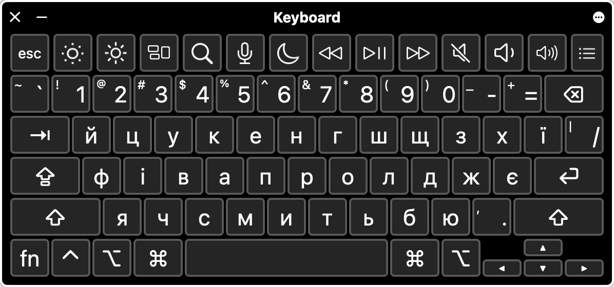

    

# Ukrainian Typography Keyboard

Ukrainian keyboard layout with typographic symbols based on [Ilya Birman's Russian typography keyboard](http://ilyabirman.ru/type)

## Installation

* Download [archive](https://github.com/AntonShevchuk/ukrainian-typography-keyboard-layout/archive/master.zip)
* Move `ukrainian-typography.bundle` to the folder with keyboard layouts for the current user:
  * Open Finder window
  * Press `Command`+`Shift`+`G`
  * Input path `~/Library/Keyboard Layouts` and press `Enter`
  * Move file here
* After a logout you can add the typhographic layout in `System Preferences` > `Keyboard` > `Input Sources` menu

## Usage

* `⌥` + `G` for `₴`

## Layout

    

* Added `ї`, `ґ`, `є` to original keys (like on the real keyboard)
* Added `і` to `S` key and `и` to `B` key (like on the PC layout)
* Added `'` to `~` key

    

* Added `₴` to `⌥` + `G`
